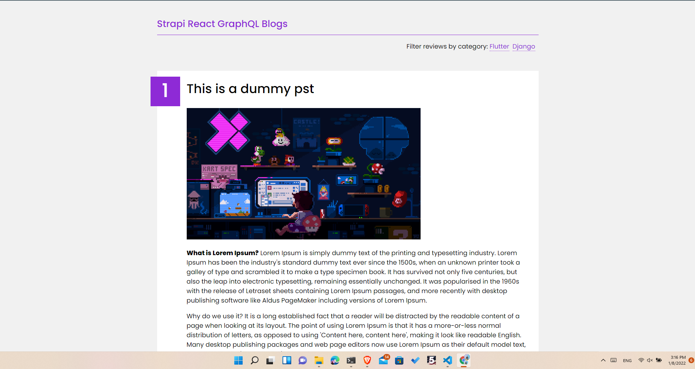
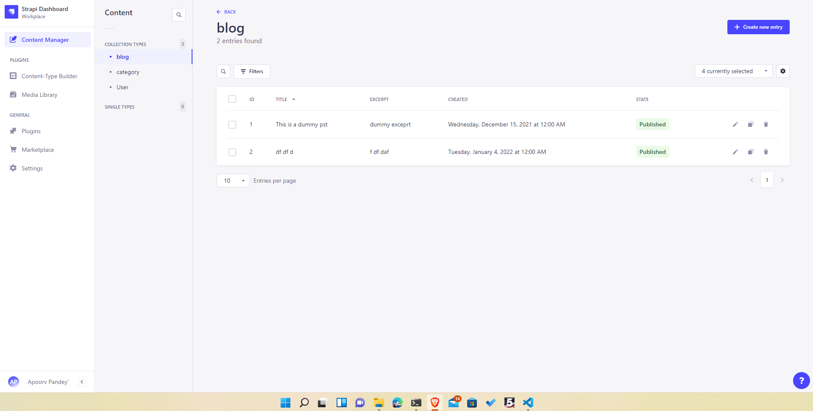

# React GraphQL Strapi Blog app

### Frontend


### Backend


### Folder structure of final project
```
project root
│
└───frontend
│   │   README.md
│   .
|   .
|   .
│   
└───backend
    │   README.md
    .
    .
    .
```


# How to start the project:

## Set up backend

### `npm create-strapi-app backend`

Create a new strapi app inside of backend folder
Place the strapi-config.json file inside backend folder
Then move to next step

### `npm run strapi configuration:restore -f strapi-config.json`

This will set up the backend with required collections and plugins

### `npm run develop`
This will start the backend server at port 1337

## Set up frontend

Now come back to frontend folder and run the following command:

### `npm install`

Installs the required dependencies for the react app


### `npm start`

Runs the app in the development mode.\
Open [http://localhost:3000](http://localhost:3000) to view it in your browser.
